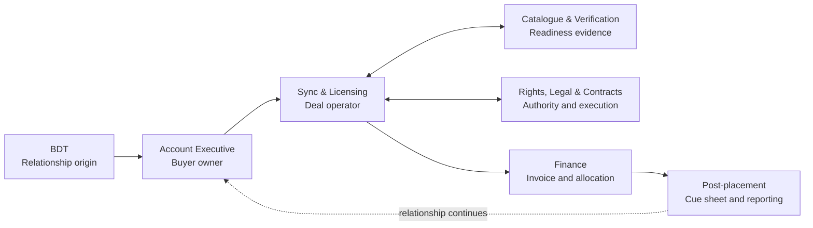

# Sync Library Operating Model

**Status:** READY FOR TEAM DISCUSSION - 2026-09-01
**Owner direction:** Curated, artist-controlled and human-reviewed; discuss the complete operating model, then assign and implement a GSD phase
**Build foundation:** Phase 26 inclusion + Phase 30 catalogue/readiness engine
**Detailed workshop TODO:** `.planning/todos/pending/2026-09-01-sync-library-operating-model-team-discussion.md`

## North star

Funūn operates a highly curated sync catalogue that protects artistic identity while
moving qualified opportunities and deals efficiently. A song is never reduced to
generic inventory. Rights readiness, cultural fit, artist guardrails and human judgment
travel with it from submission through reporting.

## Lifecycle

```text
Invite / submit
  -> rights + metadata readiness
  -> quality + cultural review
  -> admit / revise / reject
  -> controlled buyer visibility
  -> match + pitch
  -> artist approval
  -> negotiate economics
  -> contract + license + deliver
  -> pay + report
```

## Locked principles

- The Sound Vault is open; the Sync Library is curated.
- Incomplete does not mean rejected; it enters a completion workflow.
- Admission does not equal permission for every use.
- Artist guardrails and explicit exclusions are operational data, not informal notes.
- AI may assist matching/tagging but does not make final cultural or rights decisions.
- Catalogue access, pitching, licensing and clean-master delivery are distinct permissions.
- No clean-master delivery before the required contract and payment gates.
- Existing Phase 26/30 capabilities are the substrate, not throwaway prototypes.
- Representation and licensing authority remain counsel-gated.

## Funūn Deal Flow

**Owner-approved:** 2026-09-07

Funūn operates deals as a coordinated pipeline with parallel specialist lanes, not as a
strict assembly line. One team may finish a deliverable and hand it forward, but several
teams will often work simultaneously, return questions upstream and remain accountable
through completion.



### Persistent owners

Each deal retains several distinct forms of ownership:

- The **BDT originator** keeps permanent source attribution and serves as the transitional relationship sponsor.
- The **Account Executive** remains the continuing owner of the Client Partner relationship.
- **Sync & Licensing** owns operation of the specific brief or licensing deal.
- A named **specialist owner** is responsible for each clearance, contract, verification or financial workstream.
- The **Member Success owner** coordinates communication with affected members when applicable.

No one may assume that the next department has accepted responsibility. A handoff is
complete only when the receiving owner explicitly accepts it.

### Shared deal spine

Every deal has one durable master record containing the buyer and organization,
opportunity and intended use, exact songs and recordings, owners and contributors,
required decisions, clearance, commercial terms, agreements, deliveries, invoices,
payments, cue sheets, reporting, tasks, communications, deadlines and audit history.

Each team works from the same deal spine while seeing and editing only the information
permitted by its role and the record's visibility classification.

### Stage gates

1. The request is qualified before substantial search work.
2. The exact work and recording version are selected before final clearance.
3. Required rights approvals are documented before the use is represented as cleared.
4. Commercial authority approves the terms before they are finalized.
5. The agreement is executed, or a specifically authorized exception is recorded, before production delivery.
6. Finance receives the invoice handoff at the contractually defined point.
7. The use is confirmed before placement reporting.
8. Cue-sheet and payment follow-up are completed before administrative closure.

A gate may stop one action, such as production delivery, without unnecessarily freezing
unrelated work on the deal.

### Parallel specialist lanes

After selection, rights holders may confirm authority while Legal reviews exceptions,
Contract Operations prepares documents, Catalogue Operations validates metadata and
assets, Finance prepares invoice information, the AE manages buyer expectations, Member
Success coordinates creator communication and Sync keeps the transaction moving.

### Handoff standard

Every handoff records:

- Sending team and receiving owner.
- Required deliverable.
- Relevant records and attachments.
- Deadline and SLA.
- Known blockers.
- Acceptance, rejection or request for clarification.
- Escalation path.

A sent request is not an accepted handoff.

> One relationship owner, one deal operator, multiple accountable specialist lanes and one durable transaction record.

## Discussion outcome

The team must decide ownership, states, permissions, service levels and evidence across
all ten lifecycle stages. The output becomes a dedicated phase context and plan. Do not
assign the phase number until the team reconciles this work with Phases 37.2-37.5 and
the open Phase 16/29 legal/payment dependencies.

## Recommended build order

1. Verify the existing staff workflow through Phase 30 UAT.
2. Ship the operational curation/revision and artist-guardrail layer.
3. Connect briefs, matching, pitches and controlled buyer access.
4. Add artist opportunity approval and feedback loops.
5. Complete contracts, delivery and money only after counsel and external dependencies clear.

## Definition of a successful operating model

Every song, opportunity and deal has a visible owner, state, timestamp, next step and
authorization basis. Artists know where their songs are, what uses are allowed and what
happens next. Staff can operate the queue without side spreadsheets. Buyers receive only
appropriate, ready songs. No one can infer licensing authority merely from catalogue
admission, and every delivery/payment is reconcilable to the governing agreement.
