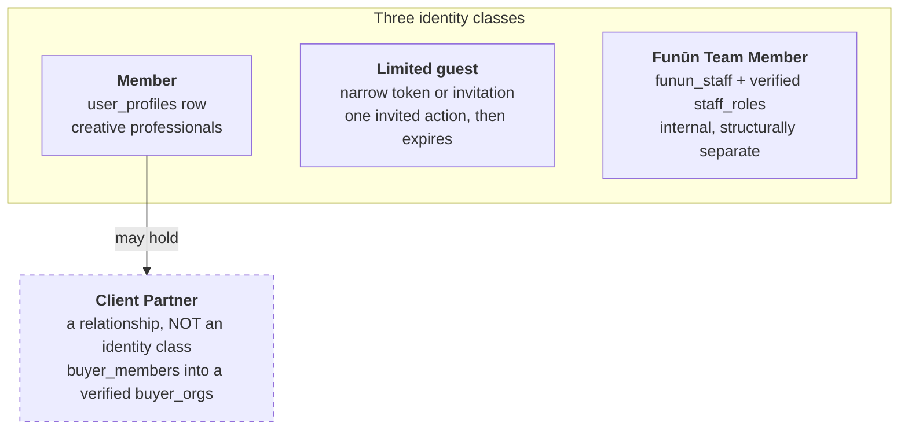

# One Identity, Many Roles — the Funūn account, workspace, and access model

**Status:** canonical product and engineering doctrine. Owner-approved September 4, 2026.

## The one-line version

> A person has one Funūn identity. Professional roles describe the person; workspace relationships grant access; project records establish authority and ownership.

Artist, songwriter, producer, manager, publisher, attorney, engineer, label executive,
music supervisor, and similar labels are **professional roles**, not account types and not
permissions.

## The three identity classes

| Identity class | Purpose | Structural signal | Product context |
|---|---|---|---|
| **Member Account** | Personal and professional creative work | `user_profiles` row | Member workspace: Ideas, Sound Vault, Writer's Room, Contract Locker, network, tools |
| **Limited guest/signature recipient** | Complete one invited action without receiving a full Funūn workspace | Narrow token, invitation, or signing record | Only the invited room, decision, or signature flow |
| **Funūn Team Member Account** | Operating the Funūn business | `funun_staff` row plus server-verified `staff_roles[]` | Internal staff/admin surfaces |

The dashed box is the point: **Client Partner hangs off Member. It is not a fourth column.** A
songwriter who also licenses music for a production company is one Member holding a Client
Partner relationship — not two accounts. Professional roles (artist, producer, manager, music
supervisor and the rest) describe the person and appear nowhere in this diagram on purpose: they
grant nothing. See *Roles, relationships, and rights are separate* below.

Client Partner is **not an identity class**. It is a verified organization relationship granted
to a Member through `buyer_members` and `buyer_orgs`. A Member may be a songwriter in their
personal context, a workspace member for several professional teams, and a music buyer for one
verified Client Partner organization without acquiring a second identity.

Limited guests and signature recipients receive a narrow, expiring invitation or signing context.
If they later join Funūn, they become a Member without losing the evidence attached to the earlier
invitation.

## One Member umbrella

Every full creative/professional user is a Member. A Member may wear any number of
professional roles and may use different roles on different works. Completing a profile is
never required before capturing an idea, entering a Writer's Room, uploading a take, writing
lyrics, or leaving a note.

The existing `member_type = 'artist' | 'industry'`, `industry_roles`, and
`capability_grants` fields remain transitional compatibility data. They must not be treated as
the canonical account taxonomy or used to hide the core Member workspace. Remove them only
after every dependent route and production record has been migrated and audited.

## Roles, relationships, and rights are separate

- **Professional role:** who a person is or what hats they wear. It may personalize copy or
  prefill a form. It grants nothing by itself.
- **Workspace relationship:** where a person may act, such as membership in a Client Partner
  organization or invitation to a Writer's Room.
- **Project authority:** what a person may do in a specific context, such as invite, approve,
  sign, download, license, or administer.
- **Rights record:** what a split sheet, contract, registration, or other evidence says about
  authorship, ownership, control, or payment.

Declaring “Music Supervisor” does not unlock The Crate. Being in a Writer's Room does not put
someone on a split sheet. Managing a project does not establish ownership or signature
authority. No actor may grant more authority than they hold.

## Member plus Client Partner

A person may simultaneously be a Member and belong to a verified Client Partner
organization under the same authenticated identity. Example: Jordan can write and produce in
a personal Member workspace while acting as a music supervisor in Netflix's Client Partner
workspace.

These contexts remain separate:

- Personal songs, collaborators, creative agreements, and rights records stay in the Member
  workspace.
- Shortlists, requests, company activity, and licensing agreements stay in the Client Partner
  organization workspace.
- The UI provides an explicit workspace switch. Data never merges merely because the same
  person can reach both contexts.
- Client Partner access is added or revoked through `buyer_members`; it must not depend on an
  exclusive `app_metadata.role = 'buyer'` check.

Current transactional code supports one Client Partner organization relationship per person.
Supporting several organizations requires an explicit active-organization selector and a
route-by-route audit; do not silently add a second membership before that phase ships.

## Corporate-email continuity

Organization access and personal identity continuity are different concerns. Before a person
relies on a corporate email as the only credential for a personal Member workspace, Funūn
must offer a verified personal login/recovery method (such as a secondary verified email or
passkey). When employment ends, the organization revokes only the Client Partner
relationship. The personal Member workspace and its records remain with the person.

This verified credential-linking flow is a dedicated authentication build. Until it exists,
the product must not claim that changing an email or typing a recovery address safely links
two identities.

## Funūn Team Member separation

Funūn Team Member identities remain privileged and structurally separate. Staff permissions
come from server-verified staff roles, are purpose-specific, and are audited. A staff identity
must not double as a Member or Client Partner identity. If a staff person also makes music,
they should use a separate personal Member login.

The account-context resolver fails closed to staff-only context if legacy data contains an
unexpected staff/member or staff/buyer overlap.

## Naming discipline

Two Funūn names contain the word "Team" and mean unrelated things. One of them is public.

| Written in full | What it is | Structural signal |
|---|---|---|
| **Funūn Team Member** | Staff operating the business | `funun_staff` + server-verified `staff_roles[]` |
| **Team** (pricing tier) | A Member tier — a Member workspace sized for several people | a Member's plan; no staff concept whatsoever |

Rules:

1. **Never write "Team Member" without "Funūn".** The bare form is the collision. In code
   comments, planning docs, commit messages and conversation, it is always *Funūn Team Member*.
2. **Never call the pricing tier a "Team account".** It is the **Team tier** of a Member account.
   Labels, management companies and multi-artist rosters on that tier and on Entourage are
   **Members** — the Member umbrella explicitly covers managers and label executives — not Client
   Partners.
3. **When a name is ambiguous, cite the structural signal, not the name.** `user_profiles`,
   `funun_staff`, `buyer_members` → `buyer_orgs` are greppable and cannot drift; a name can.
   This is the same rule as the `owner_segment` lesson: a label that nothing checks is not
   evidence.

## Public marketing surfaces address Members only

The marketing site sells the **Member** workspace and nothing else. Its pricing tiers, its
sign-up and sign-in entries, and its onboarding path are all Member-facing.

- Every tier — Writer, Studio, Team, Entourage — is a Member tier.
- "Talk to us" on the larger tiers is *answered by* Funūn Team Members, but what it creates at the
  end is a **Member workspace**.
- `/signin` is the single sign-in surface for everyone; `lib/auth/postSignInPath.ts` resolves the
  destination *after* authentication (a Client Partner relationship → `/sync/catalog`, staff →
  `/admin/client-partners`, everyone else → `/vault`). The marketing page links there because it
  is the one door, not because the page addresses those audiences.

Owner instruction, 2026-09-26: *"WE ARE ONLY talking about user accounts for Members."*

## Contract and licensing homes

- Contract Locker is available to every Member, including managers who are not writers.
- Split Sheets are a section inside Contract Locker. Existing `/split-sheets/new` and
  `/split-sheets/[id]` workflow links remain valid; the standalone list URL redirects to the
  Contract Locker section.
- Client Partner licensing documents belong with The Crate's Licenses/Agreements context,
  not in the person's Member Contract Locker.

## Provisioning and authorization rules

1. Self-serve or invited full users receive a Member profile.
2. An authorized organization administrator may attach an existing Member identity to one
   Client Partner organization; this must preserve the Member profile, subscription, vault,
   and login.
3. A genuinely new Client Partner-only recipient may continue through the legacy buyer
   provisioning path until unified onboarding replaces it.
4. Public registration must never attach an arbitrary existing email to an organization.
   Existing-identity reconciliation is service-only and follows an authorized invitation.
5. Staff remains provisioned through the staff-only path.
6. Every sensitive action is authorized server-side and through RLS where applicable. UI
   visibility is never the security boundary.

## Engineering decision rule

When adding a feature, ask in this order:

1. Which authenticated person is acting?
2. Which account context and workspace relationship are active?
3. What project-specific permission or legal authority is required?
4. Which record is authoritative for the claimed right?

Never answer any later question from a professional-role label alone.

## Member workspaces are operating contexts, not identities

A Member workspace represents an artist team, management roster, label, or combined operating
organization. It is a durable entity reached from the same Member identity through an explicit
active-workspace selector. A person may belong to several workspaces at once. Opening one must not
sign them into a different identity, merge catalogues, or make it the owner of their personal work.

- `workspace_members` determines who may enter and administer the workspace.
- `workspace_roster_relationships` records a proposed, accepted, refused, or ended professional
  relationship. It never proves ownership or legal representation by itself.
- `workspace_attachments` points to a Member-owned project without copying or transferring it.
- `workspace_grants` gives narrow, revocable project permissions rooted in a live relationship and
  current Member consent.
- Split sheets, contracts, registrations, and confirmed rights evidence remain the authorities for
  credits, ownership, control, signature, and payment.

Workspace guests receive workspace chrome only. Reaching Member project data requires the role
floor, an active roster relationship, a live attachment, a live grant, and current custody to agree.
No workspace participant can grant more access than they hold.

## Workspace billing and continuity

Workspace billing belongs to the workspace. It must never consume, replace, or silently modify an
individual Member subscription. During beta, workspaces begin on a free active plan while seat,
roster, storage, AI, e-sign, and audio-processing usage is measured but not enforced.

A paused, past-due, or canceled workspace becomes read-only. Its roster, attachments, rights
evidence, contracts, activity, and audit history remain readable; the billing lifecycle never
deletes, detaches, transfers, or rewrites Member-owned catalogue records. A missing billing decision
fails closed for workspace mutations and does not affect the Member's personal workspace.

## Rollout and emergency controls

The existing database kill switch is the single platform-wide workspace stop control. The existing
account cohort is the single beta rollout boundary. Environment configuration may end the cohort
requirement but can never override a disabled database control. Cohort membership is Leadership-only
operational information; an account outside the bounded pilot receives a 404 rather than a feature
disclosure.
