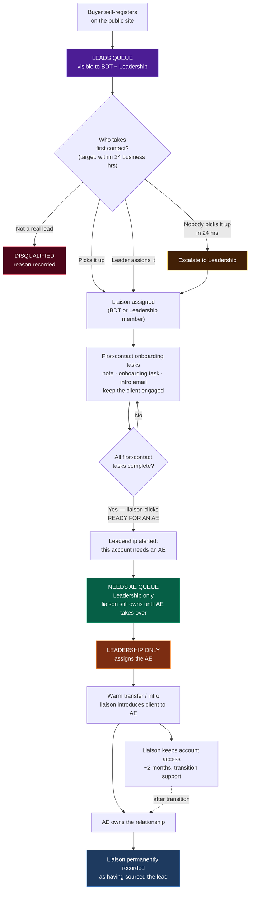

# SOP — New Lead to Assigned AE

**Owner:** Leadership · **Applies to:** BDT (Business Development Team) + Leadership
**Status:** DRAFT — agreed flow, not yet built in the product
**Last updated:** 2026-08-26

---

## Why this exists

A new buyer company that signs up on Funūn is **not** immediately handed to an
Account Executive. It first passes through a **first-contact stage**
run by BDT, whose job is to make sure the lead is genuinely onboarded and stays
engaged while Leadership decides which AE will own the ongoing relationship.

Two stages. Two different owners. Two different SOPs.

- **Stage 1 — First contact.** A BDT (or Leadership) member acts as a
  **temporary liaison**.
- **Stage 2 — AE assignment.** Leadership assigns the AE who will build the
  ongoing relationship. That assignment is not fixed — Leadership can
  reassign an account to a different AE at any time.

The liaison is a relay runner, not the destination.

---

## The flow

---

## Stage 1 — First contact (BDT + Leadership)

**Trigger:** a buyer company self-registers on the public site. No salesperson
is involved; this is inbound.

1. **The lead is published to the Leads queue.** Visible to every BDT and
   Leadership member. Everyone on those two teams is notified.
2. **Someone becomes the liaison** — either by picking the lead up themselves,
   or by a Leader assigning it to a specific BDT/Leadership person.
3. **The liaison runs the first-contact tasks.** The full checklist is still to
   be defined, but covers: a required note, an onboarding task, and an intro
   email — enough to confirm the client is real, welcomed, and engaged.
4. **When the tasks are complete, the liaison clicks "Ready for an AE."**
   This is an explicit human declaration, never inferred by the system — the
   liaison is the only one who knows whether the client is genuinely engaged.

**Why explicit:** completion of tasks is the prerequisite, but the liaison
makes the call. A checkbox count should never promote an account on its own.

---

## Stage 2 — AE assignment (Leadership only)

5. **Leadership is alerted** that an account needs an AE. It appears in the
   **Needs AE queue**.
6. **Only Leadership assigns the AE.** A BDT member cannot choose the
   AE — this is deliberately reserved for whoever manages the AE team.
7. **The liaison makes a warm transfer** — a real introduction between the
   client and their new AE, not a silent reassignment.

**AE assignment is not permanent.** Leadership can reassign an account to a
different AE at any time — that is ordinary book management (the existing D-07
handoff), and does not re-run this lead SOP.

---

## After the handoff

- **The liaison keeps account access for roughly two months** to support the
  transition. Both people may be working the client during this window.
- **The liaison is permanently recorded as having sourced the lead.** This is
  useful history and it is how BDT gets credit for sourcing.
- **Commission during the transition is shared.** The commission structure is
  not yet defined — see Open Items.

---

## Roles at a glance

| Step | BDT | Leadership | AE |
|---|---|---|---|
| See the Leads queue | ✅ | ✅ | — |
| Pick up a lead | ✅ | ✅ | — |
| Assign a liaison to someone | — | ✅ | — |
| Run first-contact tasks | ✅ | ✅ | — |
| Declare "Ready for an AE" | ✅ | ✅ | — |
| See the Needs AE queue | — | ✅ | — |
| **Assign the AE** | ❌ | ✅ | — |
| Warm transfer / intro | ✅ | ✅ | — |
| Own the ongoing relationship | — | — | ✅ |
| Transition access (~2 months) | ✅ | ✅ | ✅ |

---

## Edge cases and timing rules

These four cases are not optional detail — each one is a way a real lead gets
lost, and each was missing from the first draft of this flow.

### 1. Not every lead is a real lead — there must be an exit

Registration is a **public, unauthenticated** form. Expect spam, competitors
looking around, students, and plain bad fits.

Any BDT or Leadership member may mark a lead **Disqualified**, and **must record
a reason** (spam · competitor · not a fit · duplicate · no response). A
disqualified lead leaves the Leads queue and never reaches the Needs AE queue.

*Why it matters:* without this, junk accumulates in the queue until the queue
stops being trusted — and a queue nobody trusts is a queue nobody works. The
recorded reasons also teach you what junk actually looks like.

### 2. First contact has a clock

**Target: first contact within 24 business hours of registration.**

Inbound leads decay fast — a supervisor who registered on Tuesday has moved on
by Friday. If no one has picked a lead up within that window, it **escalates to
Leadership**, who either takes it or assigns it to someone.

*Why it matters:* the entire purpose of the BDT stage is keeping the client
engaged. A lead sitting untouched in a queue defeats the stage.

### 3. The client may act before we do

A newly registered client can immediately submit a Crate request, browse, or
reply to something — all before anyone has picked them up.

**Client momentum is never blocked by our internal queue.** They keep full
access to whatever their account allows. But that activity **flags the lead as
hot** in the queue and should pull it to the top — someone acting on their own
is the strongest buying signal available.

First contact still happens; it just becomes more urgent, not skippable.

### 4. "Ready for an AE" is not the same as handed off

When the liaison declares a lead ready, the account waits on Leadership to
assign an AE. That wait is a real gap where a client can end up in limbo.

**The liaison remains the owner until the AE actually takes over.** They are
still responsible for the client's engagement in the meantime, and the account
stays visible to them. Ownership transfers at the warm transfer, not at the
declaration.

*Why it matters:* "I thought I'd handed that off" is exactly how a client goes
quiet for two weeks.

---

## Open items (to be decided)

1. **The first-contact task list** — what exactly must be done before a lead is
   "Ready for an AE"? Currently sketched as note + onboarding task + intro
   email.
2. **Commission structure** — how the shared commission works during the
   two-month transition window, and what the sourcing credit is worth
   long-term.
3. **Exact transition length** — "about two months" is the working assumption;
   confirm before building any automatic access expiry.
4. **A liaison who goes quiet** — the 24-hour rule covers a lead nobody picks
   up. There is not yet a rule for a liaison who claims a lead and then stalls
   mid-first-contact.
5. **Disqualification reasons** — the starting list (spam · competitor · not a
   fit · duplicate · no response) should be reviewed once there is real signup
   traffic to learn from.

---

## Notes for whoever builds this

- The pipeline stages already exist and match this flow:
  `New lead → Contacted → Active → Negotiating → Closed/Dormant`.
- The **Stage 2 handoff is already built** (Phase 31.1, decision D-07):
  leadership-only AE assignment with a required handoff note, an auto-created
  onboarding task, and a best-effort intro email.
- **The gap is Stage 1.** A client today has only one ownership field
  (`ae_user_id`). This SOP needs a *second, separate* owner — the liaison —
  or picking up a lead becomes indistinguishable from becoming its AE, which
  collapses the entire distinction this SOP exists to draw.
- The Leads queue is **separate from** the Needs AE queue. They are different
  stages, different audiences, and different SOPs.

### Build sequencing (agreed 2026-08-26)

This SOP describes the target state. It is deliberately **not** all built at
once — at the time of writing the company is two people (both Leadership, one
also AE and A&R) with zero buyer companies in production.

**Build now — the part that stops a real beta lead from being missed:**
1. New leads notify **all Leadership + all BDT** members (today it notifies one
   arbitrary person — see the bug note below).
2. A visible **Leads queue** for those two teams.
3. **Disqualify with a reason.**
4. **A second owner field** on the client — the liaison, separate from
   `ae_user_id`.

That fourth item is the one thing that must not be deferred. It is cheap to add
before there are live clients and genuinely painful to retrofit afterwards;
without it, picking up a lead is indistinguishable from becoming its AE.

**Defer until there are real BDT hires and real deal volume:**
- The ~2-month transition access window
- Shared-commission mechanics
- Elaborate role separation beyond the queue itself

**Known bug to fix as part of this work:** `resolveLeadershipFallback`
(`lib/staff/leadershipFallback.ts`) selects the lead recipient with
`.eq('staff_role','leadership').limit(1)` and **no ordering**, so with more than
one Leadership member the recipient is arbitrary and can change between calls.
Fanning out to all Leadership + BDT replaces this entirely.
